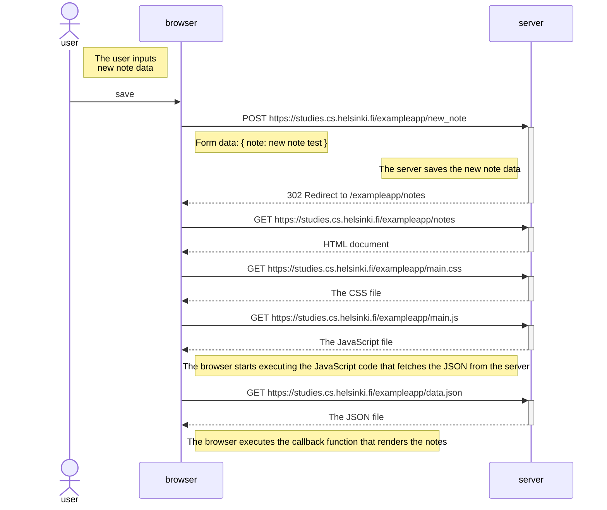

```mermaid
sequenceDiagram
    actor user
    participant browser
    participant server

    note right of user: The user inputs <br/> new note data

    user->>browser: save

    browser->>+server: POST https://studies.cs.helsinki.fi/exampleapp/new_note

    note right of browser: Form data: { note: new note test }

    note left of server: The server saves the new note data

    server-->>-browser: 302 Redirect to /exampleapp/notes

    browser->>+server: GET https://studies.cs.helsinki.fi/exampleapp/notes
    server-->>-browser: HTML document

    browser->>+server: GET https://studies.cs.helsinki.fi/exampleapp/main.css
    server-->>-browser: The CSS file

    browser->>+server: GET https://studies.cs.helsinki.fi/exampleapp/main.js
    server-->>-browser: The JavaScript file

    Note right of browser: The browser starts executing the JavaScript code that fetches the JSON from the server

    browser->>+server: GET https://studies.cs.helsinki.fi/exampleapp/data.json
    server-->>-browser: The JSON file

    Note right of browser: The browser executes the callback function that renders the notes
```