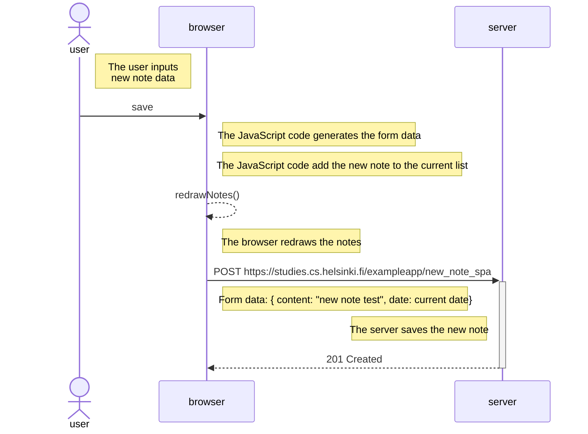

```mermaid
sequenceDiagram
    actor user
    participant browser
    participant server

    note right of user: The user inputs <br/> new note data

    user->>browser: save

    note right of browser: The JavaScript code generates the form data

    note right of browser: The JavaScript code add the new note to the current list

    browser-->>browser: redrawNotes()

    note right of browser: The browser redraws the notes

    browser->>+server: POST https://studies.cs.helsinki.fi/exampleapp/new_note_spa

    note right of browser: Form data: { content: "new note test", date: current date}

    note left of server: The server saves the new note

    server-->>-browser: 201 Created

```